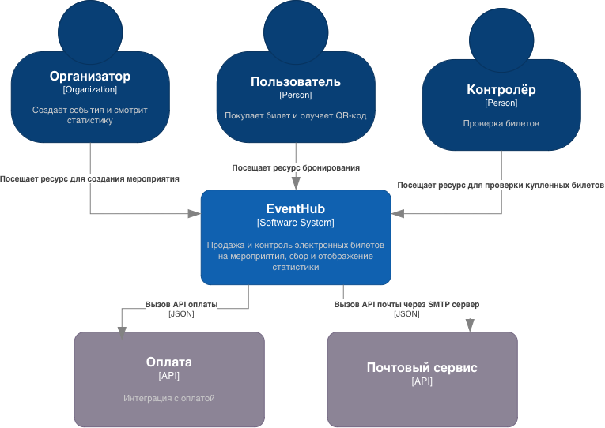

Участники группы

-  Мазяр Алексей

-  Куткин Лев

-  Терин Иван

-  Юров Степан

-  Донельчук Артём

## 📖 1.  Анализ по framework (6 вопросов архитектора)



---

*  

   Вопрос

*  

   Ответ команды

---

*  

   ⏱️Скорость изменений бизнес-требований

*  

   Средняя / высокая. Точная скорость изменений в условии не указана. Однако платформа работает с мероприятиями, продажами, оплатой и финансовой отчётностью, поэтому по мере развития продукта вероятны новые правила продаж и способы работы с мероприятиями.

---

*  

   👥 Количество независимых команд

*  

   Две команды. Бизнес область одна, одна команда на front, одна на back

---

*  

   🏛️ Legacy-ограничения

*  

   Не выявлены.

---

*  

   🛡️ Требования к SLA / отказоустойчивости

*  

   Высокие. Во время старта продаж возможны тысячи одновременных покупок. Система не должна допускать продажу одного билета дважды. Также критична доступность проверки QR-кодов непосредственно на входе на мероприятие.

---

*  

   💰 Бюджет и сроки

*  

   Большие. Микросервисная архитектура потребует больше затрат на инфраструктуру, мониторинг и развертывание, чем монолит

---

*  

   ⚙️Зрелость DevOps-культуры команды

*  

   Не указана, предполагается высокая. Для микросервисной системы необходимы автоматизированное развертывание, мониторинг и управление несколькими компонентами



## 🧩 2. Выбранный архитектурный стиль

**Стиль:** микросервисная архитектура

**Обоснование выбора** (3-4 предложения):

Система имеет явно разделимые бизнес-функции: управление мероприятиями, продажа билетов, оплата, проверка билетов и формирование статистики.

Нагрузка неравномерна: сервис покупки билетов может испытывать резкий пик при старте продаж, тогда как остальные части системы нагружены значительно меньше.

Отдельные компоненты можно масштабировать независимо: например, во время старта продаж билетов увеличить мощности именно подсистемы продажи билетов. При этом количество микросервисов следует ограничить несколькими крупными бизнес-областями, поскольку число команд и зрелость DevOps в условии не указаны.

## 📐 3. С4-диаграмма

### **Level 1 -- Context**

:::tip 

Кто взаимодействует с системой: пользователи, внешние системы

:::

{width=765px height=542px}

### Level 2 -- Containers

:::tip 

Из каких крупных частей состоит система.

:::

:::note 

Необязательно, но кто сделал - молодец

:::

[mermaid:./uchastniki-gruppy-2.mermaid::497px:363px]

## 🚩 4. Главный риск выбранного решения

-   

-   

-   

-   

## 🔀 5. Отвергнутая альтернатива

**Какой стиль рассматривали, но не выбрали:**

**Почему отказались:**

-   

-   

-   

## 👩‍💻 6. Ключевые бизнес-операции системы

:::tip 

5–7 главных действий пользователей/сервисов -- пригодится на следующем занятии по проектированию API. Например: "разместить заказ", "проверить статус", "отменить"...

:::

-   

-   

-   

-   

-   

-   

-   

-   
