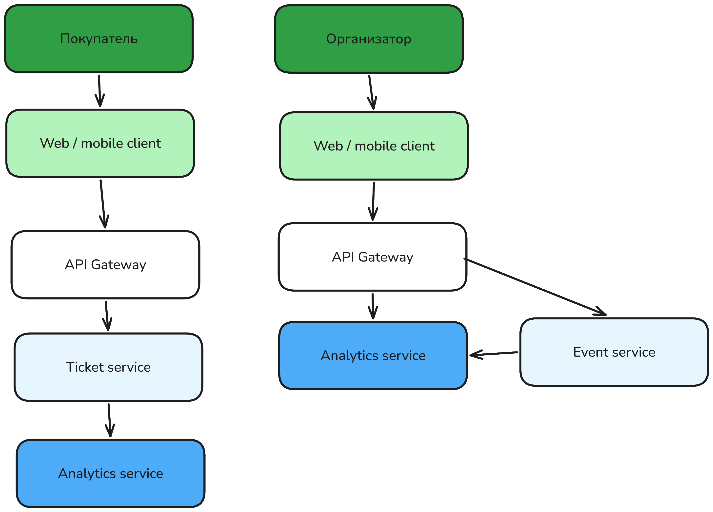

## 1\. 📖 Описание функциональных границ микросервиса

### 1\.1 Диаграмма компонентов архитектуры

{width=2888px height=2079px}

### 1\.2 Описание микросервиса

-  получение информации об успешной продаже билета:

   -  Event Service передаёт общее количество билетов на мероприятие;

   -  Ticket Service сообщает об успешных продажах;

<<<<<<< Updated upstream
   -  Ticket Service сообщает об отменённых продажах;

-  сохранение данных о продаже:

-  регистрацию успешных продаж;

регистрацию неуспешных платежей;

регистрацию отмен продаж.

хранение актуального состояния статистики;

предоставление статистики организатору по идентификатору мероприятия:

подсчёт проданных и оставшихся билетов;

подсчёт отмен;

построение динамики продаж;

группировку продаж по часам;

группировку продаж по дням;

расчёт общей выручки;

расчёт выручки по часам;

<<<<<<< Updated upstream
расчёт выручки по дням.
=======
   -  расчёт выручки по дням.
=======
**Analytics Service** обеспечивает следующую функциональность:

-  **получение информации** об успешной продаже билета;

-  **сохранение данных** о продаже;

-  **подсчёт количества проданных билетов** по мероприятию;

-  **хранение актуального состояния статистики**;

-  **предоставление статистики** организатору по идентификатору мероприятия.

Основным источником данных для сервиса является **Ticket Service**. После успешной покупки билета Ticket Service передаёт информацию о продаже. Analytics Service обрабатывает эти данные и обновляет статистику соответствующего мероприятия.

В функциональные границы Analytics Service входят:

-  получение информации об успешной продаже билета;

-  сохранение данных о продаже;

-  предотвращение повторного учёта одной и той же продажи;

-  подсчёт количества проданных билетов по мероприятию;

-  хранение актуального состояния статистики;

-  предоставление статистики организатору по идентификатору мероприятия;

-  обновление статистики при поступлении новых данных о продажах.

Таким образом, Analytics Service не участвует непосредственно в критической операции покупки билета. Он получает уже произошедшие факты продаж и на их основе формирует статистические данные.
>>>>>>> Stashed changes

:::quote 

:::quote 

:::quote 

:::quote 

:::quote 

:::quote 

:::quote 

Stashed changes

:::

:::

:::

:::

:::

:::

:::
=======
   -  Ticket Service сообщает об отменённых продажах;.

-  сохранение данных о продаже:

   -  регистрацию успешных продаж;

   -  регистрацию неуспешных платежей;

   -  регистрацию отмен продаж.

-  хранение актуального состояния статистики;

-  предоставление статистики организатору по идентификатору мероприятия:

   -  подсчёт проданных и оставшихся билетов;

   -  подсчёт отмен;

   -  построение динамики продаж;

   -  группировку продаж по часам;

   -  группировку продаж по дням;

   -  расчёт общей выручки;

   -  расчёт выручки по часам;

   -  расчёт выручки по дням.
>>>>>>> Stashed changes

## 2\. 🧩 Концептуальное проектирование API метода



---

*  

   Потребители

*  

   Цель

*  

   Задачи

*  

   Входные данные

*  

   Выходные данные

---

*  

   

*  

   

*  

   

*  

   

*  

   

---

*  

   

*  

   

*  

   

*  

   

*  

   



## 3\. 🤝 Swagger

[openapi:./_index.yaml:true]

### 