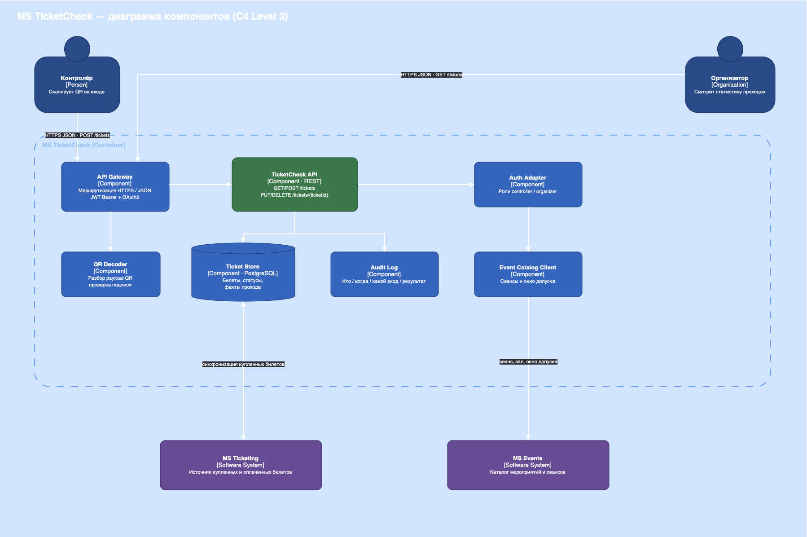

## 1\. 📖 Описание функциональных границ микросервиса

### 1\.1 Диаграмма компонентов архитектуры

{width=1140px height=568px}

### 1\.2 Описание микросервиса

MS TicketCheck обеспечивает следующую функциональность:

1. Приём QR-кода или идентификатора билета от контролёра

2. Сверка билета с мероприятием и сеансом

3. Проверка оплаты и окна допуска

4. Погашение билета при успешной проверке

5. Возврат результата проверки на экран контролёра

## 2\. 🧩 Концептуальное проектирование API метода

| Потребители           | Цель                                     | Задачи                                  | Входные данные                           | Выходные данные                                                                      |
|-----------------------|------------------------------------------|-----------------------------------------|------------------------------------------|--------------------------------------------------------------------------------------|
| Приложение контролёра | Пропустить зрителя или отказать во входе | Принять QR-код или идентификатор билета | ticketCode или ticketId, eventId, gateId | ticketId                                                                             |
| Приложение контролёра | Пропустить зрителя или отказать во входе | Сверить билет с мероприятием и сеансом  | ticketId, eventId, sessionId             | признак принадлежности билета мероприятию                                            |
| Приложение контролёра | Пропустить зрителя или отказать во входе | Проверить оплату и окно допуска         | ticketId, текущее время                  | признак оплаты и признак допуска по времени                                          |
| Приложение контролёра | Пропустить зрителя или отказать во входе | Погасить билет при успешной проверке    | ticketId, redeem                         | статус билета REDEEMED                                                               |
| Приложение контролёра | Пропустить зрителя или отказать во входе | Вернуть результат проверки на экран     | result, карточка билета                  | VALID, ALREADY_USED, NOT_FOUND, WRONG_EVENT, NOT_PAID, EXPIRED, NOT_STARTED, REVOKED |

[openapi:./fio-proektirovanie-api-2.yaml:true]