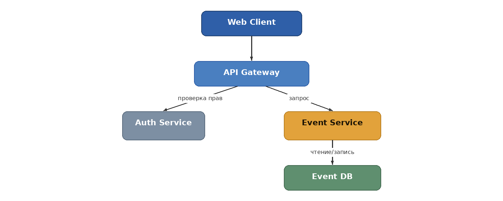

## 1\. 📖 Описание функциональных границ микросервиса

### 1\.1 Диаграмма компонентов архитектуры

{width=1400px height=560px} 

Веб-клиент отправляет запрос через API Gateway. Gateway обращается к Auth Service для проверки прав пользователя, затем маршрутизирует запрос в Event Service, который читает и записывает данные в собственную базу мероприятий (Event DB).

### 1\.2 Описание микросервиса

```
Event Service обеспечивает следующую функциональность:
●	Создание мероприятия организатором (название, дата, место, число билетов, цена)
●	Просмотр списка мероприятий (афиши) посетителем
●	Просмотр детальной информации о конкретном мероприятии
●	Редактирование мероприятия организатором
●	Отмену (удаление) мероприятия
```

## 2\. 🧩 Концептуальное проектирование API метода



---

*  

   Потребители

*  

   Цель

*  

   Задачи

*  

   Входные данные

*  

   Выходные данные

---

*  

   Front-end организатора

*  

   Создать мероприятие

*  

   Завести событие с параметрами и числом билетов

*  

   название, дата, место, кол-во билетов, цена

*  

   id мероприятия, статус

---

*  

   Front-end организатора

*  

   Изменить мероприятие

*  

   Обновить данные события

*  

   id мероприятия, изменённые поля

*  

   обновлённое мероприятие

---

*  

   Front-end организатора

*  

   Отменить мероприятие

*  

   Удалить/отменить событие

*  

   id мероприятия

*  

   статус отмены

---

*  

   Front-end посетителя

*  

   Смотреть афишу

*  

   Получить список мероприятий

*  

   фильтр по статусу (опц.)

*  

   список мероприятий

---

*  

   Front-end посетителя

*  

   Открыть мероприятие

*  

   Получить детали события

*  

   id мероприятия

*  

   данные мероприятия



## 3\. 🤝 Swagger

[openapi:./_index-2.yaml:true]

### 