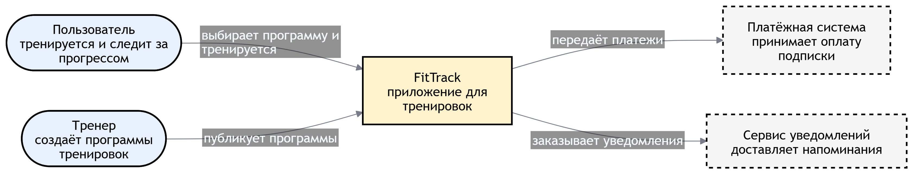

Участники группы

-  Фролова Вероника

-  Бахтин Данил

-  Канафьева Виктория

-  Морозова Варвара

## 📖 1.  Анализ по framework (6 вопросов архитектора)



---

*  

   Вопрос

*  

   Ответ команды

---

*  

   ⏱️Скорость изменений бизнес-требований

*  

   **Высокая.** Стартап на конкурентном рынке: гипотезы и фичи (новые форматы тренировок, геймификация, социальные механики, интеграции) будут появляться и меняться постоянно. Архитектура должна позволять быстро выпускать изменения без каскадных правок во всей системе.

---

*  

   👥 Количество независимых команд

*  

   **Мало на старте (1-2 продуктовые команды)**, с ростом аудитории и продукта команды могут добавляться. Сейчас архитектура «для многих независимых команд» не нужна, но нужна модульность, чтобы будущие команды могли работать в границах модулей без постоянных конфликтов.

---

*  

   🏛️ Legacy-ограничения

*  

   **Отсутствуют.** Собственного легаси нет, интеграции только внешние и стандартные: платёжный провайдер / биллинг магазинов приложений, push-сервис (FCM/APNs). Это даёт свободу выбора технологий и не не привязывает нас к интеграционным стилям SOA/ESB».

---

*  

   🛡️ Требования к SLA / отказоустойчивости

*  

   **Средне-высокие, нагрузка неравномерная:** выраженный вечерний пик + всплески после упоминаний. Важно, чтобы в пик не падали тренировки и оплата. Система не «жизненно важная», но сбои бьют по репутации.

---

*  

   💰 Бюджет и сроки

*  

   **Сроки критичны, бюджет ограничен** (стартап). Конкуренты запускают аналогичные продукты - нужны быстрый запуск MVP и минимальные инфраструктурные расходы на старте, без больших инвестиций в сложную платформу.

---

*  

   ⚙️Зрелость DevOps-культуры команды

*  

   **Средняя / формирующаяся.** Команда способна настроить CI/CD, контейнеризацию и облачный автоскейлинг, но обслуживать сложную распределённую систему - пока нет.



## 🧩 2. Выбранный архитектурный стиль

**Стиль:** модульный монолит (одно приложение, внутри - чёткие модули: программы, тренировки, прогресс, подписки).

**Обоснование выбора** (3-4 предложения):

-  Нужно запуститься максимально быстро: одна кодовая база - самый короткий путь к MVP.

-  Команда маленькая, поэтому плюсы микросервисов (независимая работа многих команд) всё равно не проявились бы

-  Модули держат код в порядке и потом позволят спокойно разрезать систему на сервисы, без переписывания с нуля.

-  Вечерние пики закрываются простым горизонтальным масштабированием.

## 📐 3. С4-диаграмма

### **Level 1 -- Context**

:::tip 

Кто взаимодействует с системой: пользователи, внешние системы

:::

{width=3367px height=646px}

### Level 2 -- Containers

:::tip 

Из каких крупных частей состоит система.

:::

:::note 

Необязательно, но кто сделал - молодец

:::

[mermaid:./uchastniki-gruppy.mermaid::497px:363px]

## 🚩 4. Главный риск выбранного решения

-  Когда вырастут аудитория и команда, монолит станет тесным: релизы общие, разработчики мешают друг другу.

-  Одна ошибка (например, в модуле статистики) может уронить всё приложение, включая оплату.

-  Масштабируется весь монолит целиком, хотя нагрузка идёт на один модуль - лишние расходы на серверы.

-  Если не держать границы модулей, потом разрезать систему на сервисы будет почти невозможно.

## 🔀 5. Отвергнутая альтернатива

**Какой стиль рассматривали, но не выбрали:** микросервисы.

**Почему отказались:**

-  Долгий старт: сначала придётся построить много инфраструктуры, а это потеря главного преимущества - скорости выхода на рынок.

-  При маленькой команде микросервисы не дают своей главной выгоды - независимой работы нескольких команд.

-  Нужен DevOps, которого у нас пока нет: команда будет заниматься эксплуатацией вместо продукта.

## 👩‍💻 6. Ключевые бизнес-операции системы

:::tip 

5–7 главных действий пользователей/сервисов -- пригодится на следующем занятии по проектированию API. Например: "разместить заказ", "проверить статус", "отменить"...

:::

-  Выбрать программу тренировок из каталога.

-  Начать тренировку.

-  Отметить выполнение упражнения.

-  Завершить тренировку и сохранить результат.

-  Посмотреть статистику прогресса.

-  Опубликовать программу тренировок (тренер).

-  Купить премиум-подписку на программу.