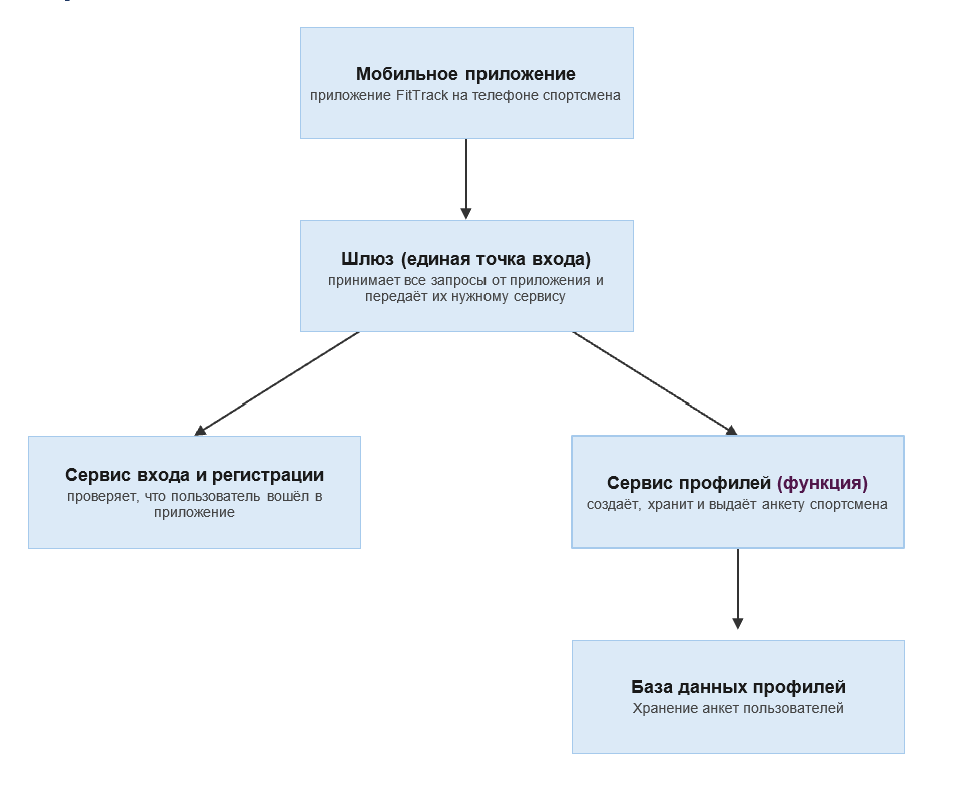

## 1\. 📖 Описание функциональных границ микросервиса

### 1\.1 Диаграмма компонентов архитектуры

{width=966px height=806px}

### 1\.2 Описание микросервиса

```
Создание профиля спортсмена после регистрации в приложении;
Хранение личных данных (имя, фамилия, дата рождения, пол);
Хранение физических параметров (рост и вес);
Хранение цели тренировок (снижение веса, набор мышечной массы, выносливость, здоровье)
 и уровня подготовки (начинающий, средний, продвинутый);
Получение профиля по его идентификатору для отображения в приложении.
```

## 2\. 🧩 Концептуальное проектирование API метода



---

*  

   Потребители

*  

   Цель

*  

   Задачи

*  

   Входные данные

*  

   Выходные данные

---

*  

   front-end

*  

   Создать профиль после регистрации

*  

   Сохранить анкету спортсмена в БД профилей

*  

   Имя, фамилия, дата рождения, пол, рост, вес, цель тренировок, уровень подготовки

*  

   Идентификатор созданного профиля

---

*  

   front-end

*  

   Просмотреть свой профиль

*  

   Найти профиль по идентификатору и вернуть его данные

*  

   Идентификатор профиля

*  

   Данные профиля



## 3\. 🤝 Swagger

[openapi:./_index-2.yaml:true]

### 