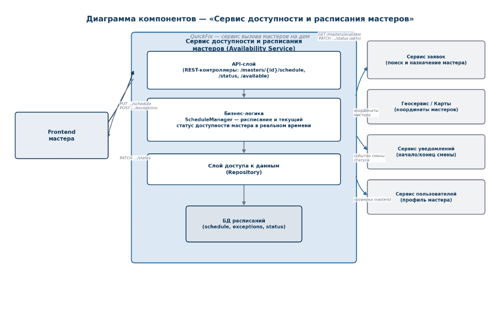

## 1\. 📖 Описание функциональных границ микросервиса

### 1\.1 Диаграмма компонентов архитектуры

{width=1140px height=730px}

### 1\.2 Описание микросервиса

Availability Service (Сервис доступности и расписания мастеров) -- микросервис платформы QuickFix, отвечающий за регулярное расписание работы мастеров и их текущий статус доступности в реальном времени.

Зона ответственности сервиса:-- хранение регулярного расписания работы мастера (рабочие дни недели и часы приёма заявок);-- управление разовыми исключениями в расписании (отпуск, больничный, дополнительная смена на конкретную дату);-- отслеживание текущего статуса мастера (online_free -> online_busy -> offline) и его автоматическое изменение при назначении и завершении заявки;-- предоставление списка мастеров, доступных прямо сейчас, по категории услуги и геопозиции -- для Сервиса заявок;-- публикация событий об изменении статуса мастера (ScheduleUpdated, MasterStatusChanged) для других сервисов платформы.

## 2\. 🧩 Концептуальное проектирование API метода



---

*  

   Потребители

*  

   Цель

*  

   Задачи

*  

   Входные данные

*  

   Выходные данные

---

*  

   **Frontend мастера**

*  

   Установить регулярное расписание работы

*  

   Задать рабочие дни недели и часы, в которые мастер принимает заявки

*  

   masterId, weeklySchedule\[\] \{dayOfWeek, startTime, endTime}

*  

   masterId, scheduleId, updatedAt

---

*  

   **Frontend мастера**

*  

   Добавить исключение в расписание

*  

   Оформить отпуск, больничный или дополнительную смену на конкретную дату

*  

   masterId, date, type (DAY_OFF | EXTRA_SHIFT), startTime, endTime (опц.)

*  

   exceptionId, status

---

*  

   **Сервис заявок**

*  

   Получить список доступных мастеров сейчас

*  

   Найти свободных мастеров нужной категории услуг поблизости от заказчика

*  

   category, lat, lon, radiusKm

*  

   список: masterId, distanceKm, status



## 3\. 🤝 Swagger

[openapi:./_index-3.yaml:true]

### 