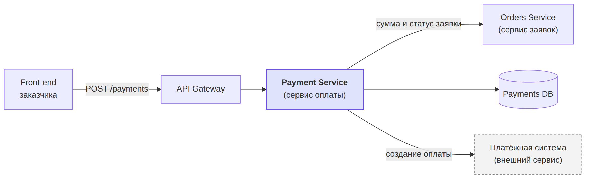

## 1\. 📖 Описание функциональных границ микросервиса

### 1\.1 Диаграмма компонентов архитектуры

{width=2352px height=720px}

### 1\.2 Описание микросервиса

**Payment Service** (сервис оплаты) - микросервис платформы QuickFix, который отвечает за оплату выполненной мастером работы через приложение. Взаимодействует с другими компонентами по REST API.

Что делает сервис: по запросу заказчика создаёт платёж по выполненной заявке. Сумму и статус заявки сервис получает у сервиса заявок (Orders Service), сохраняет платёж в свою базу данных (Payments DB) и создаёт оплату во внешней платёжной системе, которая возвращает ссылку на форму оплаты.

Сервис **не отвечает** за создание заявок, подбор мастеров, рейтинги, уведомления и авторизацию пользователей. Данные банковских карт сервис не хранит - их заказчик вводит на форме платёжной системы.

Основные данные: идентификатор платежа, идентификатор заявки, способ оплаты, сумма, статус платежа, ссылка на оплату.

Бизнес-правило: **оплатить можно только выполненную заявку и только один раз**.

## 2\. 🧩 Концептуальное проектирование API метода



---

*  

   Потребители

*  

   Цель

*  

   Задачи

*  

   Входные данные

*  

   Выходные данные

---

*  

   **Front-end заказчика**

*  

   **Оплатить выполненную работу мастера**

*  

   **Создать платёж по выполненной заявке и получить ссылку на форму оплаты**

*  

   **Идентификатор заявки, способ оплаты (карта / СБП)**

*  

   **Идентификатор платежа, сумма, статус платежа, ссылка на оплату**



## 3\. 🤝 Swagger

[openapi:./_index-4.yaml:true]

### 