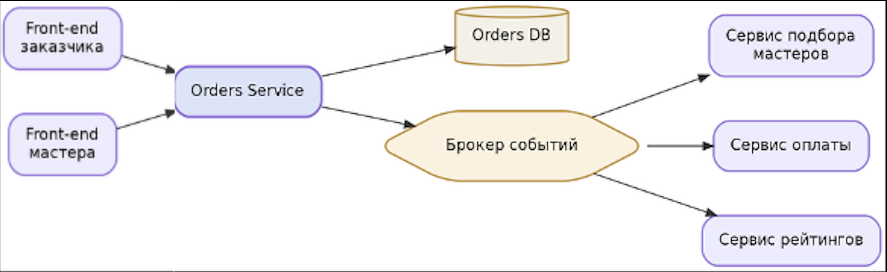

## 1\. 📖 Описание функциональных границ микросервиса

### 1\.1 Диаграмма компонентов архитектуры

{width=832px height=180px}

### 1\.2 Описание микросервиса

Orders Service (сервис заявок) -- микросервис платформы QuickFix, отвечающий за жизненный цикл заявки на бытовой ремонт: от создания заказчиком до фиксации выполнения работы мастером.

Зона ответственности сервиса:

-- приём и валидация заявки от заказчика (описание проблемы, адрес, категория услуги, координаты);

-- хранение заявки и управление её статусом (new -> accepted -> completed / cancelled);

-- обработка принятия заявки мастером по принципу «первый пришёл -- забрал заказ»: заявка атомарно закрывается для остальных мастеров;

-- фиксация факта завершения работы мастером;

-- публикация событий об изменении статуса заявки (OrderCreated, OrderAccepted, OrderCompleted) для других сервисов платформы.

## 2\. 🧩 Концептуальное проектирование API метода



---

*  

   Потребители

*  

   Цель

*  

   Задачи

*  

   Входные данные

*  

   Выходные данные

---

*  

   **Front-end (заказчик)**

*  

   **Создать заявку на ремонт**

*  

   **Сформировать заявку с описанием проблемы, адресом и категорией услуги, отправить в систему**

*  

   **Идентификатор заказчика, категория услуги (сантехник, электрик, сборка мебели), описание проблемы, адрес**

*  

   **Идентификатор созданной заявки, статус заявки**

---

*  

   **Front-end (мастер)**

*  

   **Принять заявку в работу**

*  

   **Подтвердить принятие свободной заявки первым; заявка атомарно закрывается для остальных мастеров**

*  

   **Идентификатор заявки и идентификатор мастера, который принимает заявку**

*  

   **Статус принятия заявки (успешно принята или уже занята другим мастером), идентификатор мастера-исполнителя и время принятия**

---

*  

   **Front-end (заказчик или мастер)**

*  

   **Получить статус и детали заявки**

*  

   **Запросить текущее состояние заявки для отображения в приложении**

*  

   **Идентификатор заявки**

*  

   **Статус заявки, адрес и описание проблемы, категория услуги, идентификатор назначенного мастера (если есть), время создания, принятия и завершения заявки**

---

*  

   **Front-end (мастер)**

*  

   **Отметить заявку как выполненную**

*  

   **Зафиксировать завершение работы по заявке, инициировать события для оплаты и рейтинга**

*  

   **Идентификатор заявки, идентификатор мастера и комментарий о выполненной работе**

*  

   **Статус завершения заявки и время её завершения**



## 3\. 🤝 Swagger

[openapi:./_index.yaml:true]

### 