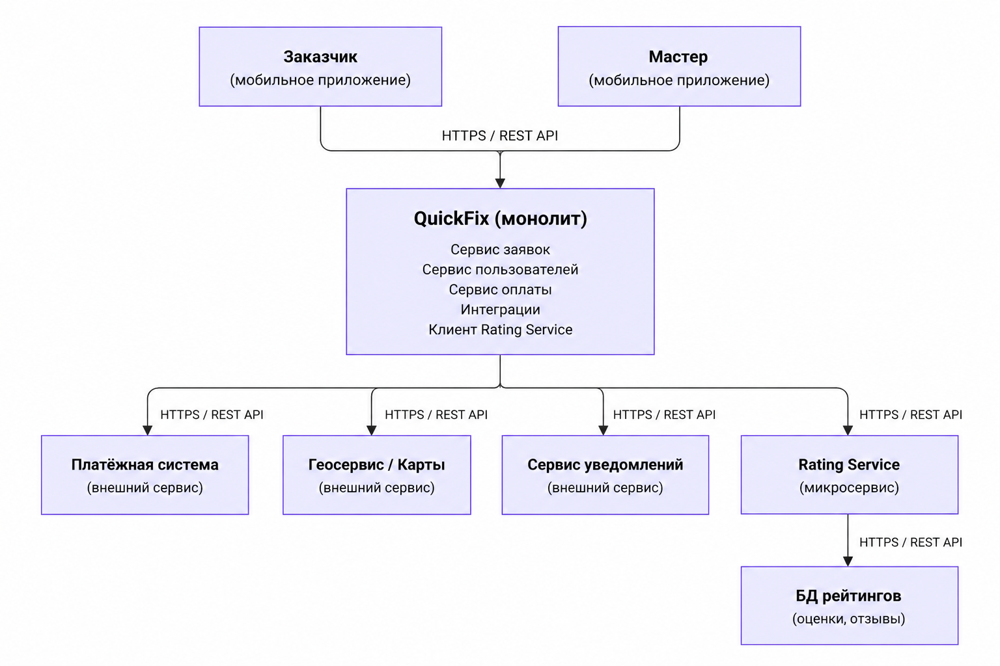

## 1\. 📖 Описание функциональных границ микросервиса

### 1\.1 Диаграмма компонентов архитектуры

{width=1536px height=1024px}

### 1\.2 Описание микросервиса

**Rating Service** -- микросервис системы QuickFix, отвечающий за работу с оценками и отзывами о мастерах. Он выделен из основного монолита и взаимодействует с ним через REST API.

Микросервис выполняет следующие функции: создание оценки мастеру после завершения заявки, сохранение текстового отзыва, получение оценок и отзывов по конкретному мастеру, расчёт его среднего рейтинга. Функциональные границы сервиса ограничены только работой с рейтингами и отзывами. Он **не отвечает** за создание и обработку заявок, управление пользователями, проведение оплаты, поиск мастеров, работу с картами и отправку уведомлений -- эти функции остаются в основном приложении QuickFix. В исходной архитектуре именно заявки, пользователи, оплата и интеграции относятся к монолиту. Основные данные микросервиса: идентификатор заявки, идентификатор заказчика, идентификатор мастера, оценка, текст отзыва и дата создания. Отдельная база данных используется для хранения оценок и отзывов.

Также для сервиса действует бизнес-правило: **одну завершённую заявку можно оценить только один раз**. Это уже наша детализация логики микросервиса на основе требования, что после выполнения работы заказчик оценивает мастера.

## 2\. 🧩 Концептуальное проектирование API метода



---

*  

   Потребители

*  

   Цель

*  

   Задачи

*  

   Входные данные

*  

   Выходные данные

---

*  

   

*  

   

*  

   

*  

   

*  

   

---

*  

   

*  

   

*  

   

*  

   

*  

   



## 3\. 🤝 Swagger

[openapi:./_index-2.yaml:true]

### 