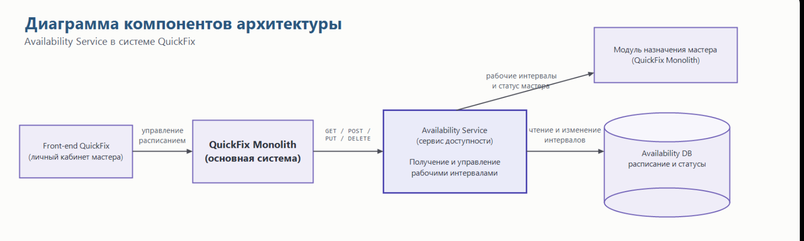

## 1\. 📖 Описание функциональных границ микросервиса

### 1\.1 Диаграмма компонентов архитектуры

{width=1722px height=517px}

### 1\.2 Описание микросервиса

Availability Service - микросервис системы QuickFix, отвечающий за управление доступностью и расписанием мастеров для выполнения заказов.

Основная система обращается к сервису, когда необходимо определить, может ли конкретный мастер принять заявку в заданный временной интервал. Сервис проверяет корректность дат, наличие рабочего интервала, периоды недоступности и пересечения, после чего возвращает признак доступности и причину результата.

## 2\. 🧩 Концептуальное проектирование API метода



---

*  

   Потребители

*  

   Цель

*  

   Задачи

*  

   Входные данные

*  

   Выходные данные

---

*  

   Модуль назначения мастера QuickFix Monolith (`GET`)

*  

   Получить расписание мастера за период

*  

   Запросить рабочие интервалы мастера за указанный период

*  

   `masterId`, `from`, `to`

*  

   Массив рабочих интервалов: `id`, `masterId`, `start`, `end`, `status`

---

*  

   Личный кабинет мастера QuickFix Monolith (`POST`)

*  

   Добавить рабочий интервал

*  

   Создать новый интервал в расписании мастера

*  

   `masterId`; тело запроса: `start`, `end`, `status`

*  

   Созданный интервал: `id`, `masterId`, `start`, `end`, `status`

---

*  

   Личный кабинет мастера QuickFix Monolith (`PUT`)

*  

   Изменить рабочий интервал

*  

   Обновить существующий интервал расписания

*  

   `masterId`, `intervalId`; тело запроса: `start`, `end`, `status`

*  

   Обновлённый интервал: `id`, `masterId`, `start`, `end`, `status`

---

*  

   Личный кабинет мастера QuickFix Monolith (`DELETE`)

*  

   Удалить рабочий интервал

*  

   Удалить выбранный интервал из расписания мастера

*  

   `masterId`, `intervalId`

*  

   Код `200` -- интервал удалён; тело ответа отсутствует

---

*  

   

*  

   

*  

   

*  

   

*  

   



## 3\. 🤝 Swagger

[openapi:./_index-2.yaml:true]

### 