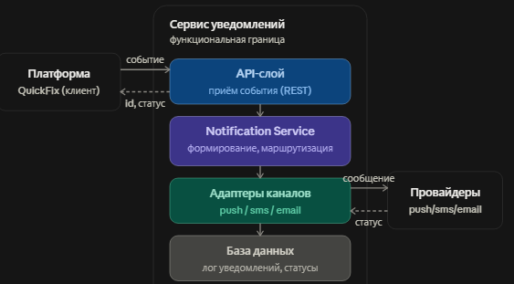

## 1\. 📖 Описание функциональных границ микросервиса

### 1\.1 Диаграмма компонентов архитектуры

{width=563px height=311px}

### 1\.2 Описание микросервиса

Сервис уведомлений отвечает за информирование пользователей платформы QuickFix  о ключевых событиях по заявкам: создание заявки, принятие в работу мастером, завершение работы, проведение оплаты, изменение статуса. Сервис принимает события от основного приложения через API, формирует текст сообщения по шаблону, определяет канал доставки (push, sms, email) и передаёт сообщение соответствующему адаптеру, который взаимодействует с внешним провайдером (FCM/APNs, SMS-шлюз, email-провайдер). Сервис хранит историю уведомлений и их статус доставки (в очереди / отправлено / доставлено / ошибка), что позволяет отслеживать доставку и повторно отправлять неудачные уведомления.

*Не входит в границы сервиса:* принятие решений о том, когда и кому отправлять уведомление (это остаётся в бизнес-логике платформы), аутентификация пользователей, обработка платежей, подбор мастеров.

## 2\. 🧩 Концептуальное проектирование API метода



---

*  

   Потребители

*  

   Цель

*  

   Задачи

*  

   Входные данные

*  

   Выходные данные

---

*  

   Бизнес-логика платформы QuickFix

*  

   Уведомить пользователя о событии по заявке

*  

   Сформировать текст по шаблону; выбрать канал доставки; передать сообщение адаптеру; зафиксировать статус

*  

   userId, тип события, канал (push/sms/email), данные для шаблона (номер заявки, статус и т.д.)

*  

   notificationId, статус постановки в обработку

---

*  

   Бизнес-логика платформы / служба поддержки

*  

   Получить историю и статус уведомлений пользователя

*  

   Найти уведомления по userId; отфильтровать по статусу; вернуть список с пагинацией

*  

   userId, статус (опционально), лимит

*  

   список уведомлений (id, тип, канал, статус, дата)



## 3\. 🤝 Swagger

[openapi:./_index-4.yaml:true]

### 