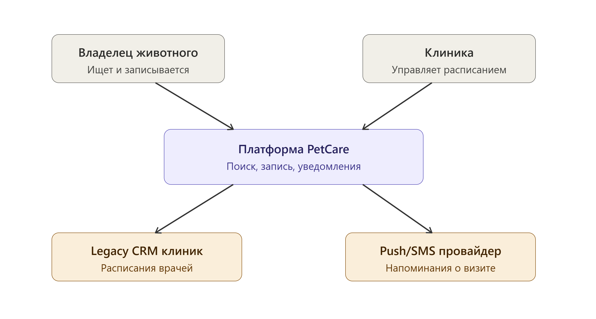
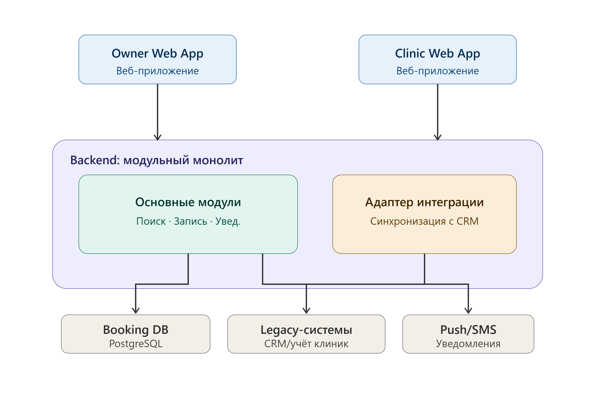

Участники группы

-  Макаренко Карина

-  Юршенайте Настя

-  Кошелева Аня

-  Маркелов Егор

-  Русакова Марго

## 📖 1.  Анализ по framework (6 вопросов архитектора)



---

*  

   Вопрос

*  

   Ответ команды

---

*  

   ⏱️Скорость изменений бизнес-требований

*  

   Средняя: расписания врачей, слоты и специализации меняются часто, но это не требует передеплоя всего приложения - скорее гибкой модели данных под слоты/врачей

---

*  

   👥 Количество независимых команд

*  

   Сейчас план старта в одном городе, потом масштабирование по всей стране. Разумно закладывать рост числа команд (по регионам/направлениям: поиск, бронирование, интеграции с клиниками)

---

*  

   🏛️ Legacy-ограничения

*  

   Указано, что разные клиники используют разные внутренние системы учёта, значит новую платформу нужно интегрировать с множеством разнородных legacy-систем, а не заменять их

---

*  

   🛡️ Требования к SLA / отказоустойчивости

*  

   Не указаны. Если упадёт запись на приём - это критично (упущенная запись, недовольный пользователь); если временно недоступны напоминания - уже не критично

---

*  

   💰 Бюджет и сроки

*  

   Бюджет на старте ограничен, инвестиции в дальнейшее развитие зависят от успеха пилота, то есть решение должно быть дешёвым для MVP, но допускать дальнейшее масштабирование без переписывания с нуля

---

*  

   ⚙️Зрелость DevOps-культуры команды

*  

   Не указана явно, но стартап с ограниченным бюджетом на старте вряд ли располагает зрелой DevOps-практикой для поддержки распределённой системы



## 🧩 2. Выбранный архитектурный стиль

**Стиль: Монолит**

**Обоснование выбора** (3-4 предложения):

-  Из-за того, что PetCare планирует один город на старте, то нагрузка относительно ограничена, так что на этапе MVP важна низкая стоимость разработки и эксплуатации.

-  Вероятно, небольшая команда, так что делать микросервисную архитектуру неоправданно, так как это увеличит к DevOps и инфраструктуре.

-  Основные домены (поиск/каталог клиник, запись/расписание, уведомления) можно чётко разделить на модули внутри одного приложения

-  Экспансия требует закладывать четкие границы между модулями с самого начала, чтобы позже (при росте команд и нагрузки) можно было беспрепятственно выделить их в отдельные сервисы.

## 📐 3. С4-диаграмма

### **Level 1 -- Context**

{width=2760px height=1480px}

### Level 2 -- Containers

{width=2760px height=1816px}

## 🚩 4. Главный риск выбранного решения

**Главный риск -- усложнение развития и масштабирования монолита при подключении большого количества клиник с разными внутренними системами учёта.**

На этапе пилота в одном городе монолит соответствует контексту проекта: его можно быстрее и дешевле разработать, развернуть и поддерживать силами небольшой команды. Однако при выходе PetCare на федеральный рынок количество клиник, пользователей и вариантов интеграции с legacy-системами будет расти.

Если логика поиска, расписаний, записи, уведомлений и интеграций останется тесно связанной внутри одного приложения, это приведёт к следующим последствиям:

-  изменение интеграции с одной клиникой может потребовать тестирования и повторного развёртывания всей системы;

-  специфическая логика разных клиник будет накапливаться в общей кодовой базе и снижать сопровождаемость;

-  нельзя будет независимо масштабировать наиболее нагруженные функции, например поиск клиник и получение свободных слотов;

-  ошибка в одном компоненте, например в адаптере к legacy-системе клиники, может повлиять на весь сервис;

-  совместные релизы будут становиться дольше и рискованнее по мере роста системы и команды.

## 🔀 5. Отвергнутая альтернатива

**Какой стиль рассматривали, но не выбрали: микросервис**

**Почему отказались:**

-  микросеврсисы это более высокий порог входа и средняя стоимость поддержки на старте, тогда как у монолита эти показатели ниже, ЧТО больше подходит нам в связи с маленьким масштабом на старте.

-  бизнес-логика пока что очень тесно связана: нет очевидной необходимости разносить эти операции по отдельным сетевым сервисам уже на этапе MVP.

-  так как микросервисы работают по HTTP/REST, gRPC или через очереди, а каждый сервис имеет собственные границы и инфраструктуру, то для PetCare это означает дополнительные вопросы: что произойдёт при недоступности сервиса расписания и т.д.

-  пока что мы не знаем, какие части системы действительно нужно масштабировать отдельно, поэтому преждевременная декомпозиция может привести к архитектуре, которая не будет оптимизирована под долгосрочные проблемы.

## 👩‍💻 6. Ключевые бизнес-операции системы

1\) Найти клинику/врача

2\) Посмотреть свободные слоты выбранного врача на дату

3\) Записаться на приём

4\) Перенести запись на другой слот

5\) Отменить запись

6\) Отправить напоминание о визите владельцу

7\) Обновить расписание врача (клиника: рабочие часы, отпуск, блокировка слотов)