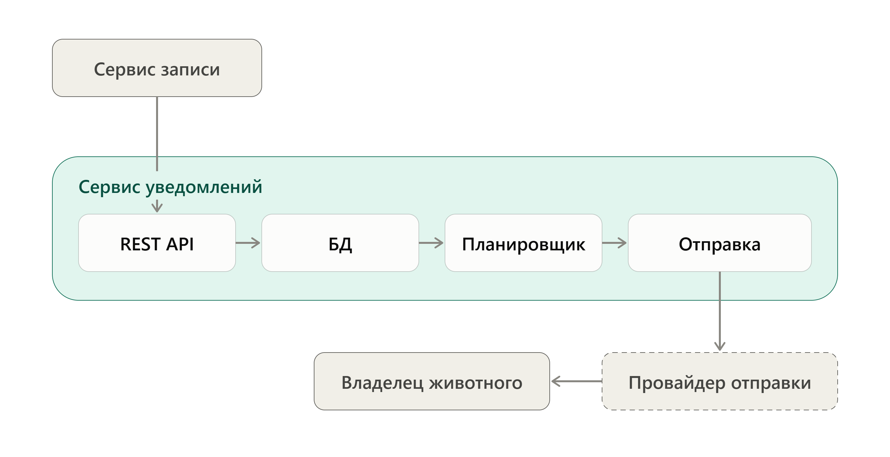

## 1\. 📖 Описание функциональных границ микросервиса

### 1\.1 Диаграмма компонентов архитектуры

{width=2720px height=1400px}

### 1\.2 Описание микросервиса

*Сервис уведомлений* обеспечивает следующую функциональность:

-  **Приём запросов от Сервиса записи** через REST API: создание, перенос и отмена напоминания о визите

-  **Хранение напоминаний** в БД: время отправки, данные о визите и статус (запланировано, отправлено, отменено, ошибка)

-  **Отслеживание времени отправки**: планировщик находит напоминания, которые нужно отправить

-  **Отправка напоминания**:

   -  формируется текст с датой и временем визита, клиникой, врачом и данными о визите;

   -  сообщение передаётся внешнему провайдеру отправки, который доставляет его владельцу животного.

-  **Получение статуса напоминания** по запросу

## 2\. 🧩 Концептуальное проектирование API метода



---

*  

   Потребители

*  

   Цель

*  

   Задачи

*  

   Входные данные

*  

   Выходные данные

---

*  

   Сервис записи

*  

   Создать уведомление напоминания о визите

*  

   Проверить данные, рассчитать время отправки, сохранить напоминание

*  

   Идентификатор записи, контакт владельца, дата и время визита, клиника, врач, целевое действие

*  

   Идентификатор напоминания, время отправки, статус

---

*  

   Сервис записи

*  

   Перенести напоминание при переносе записи

*  

   Найти напоминание, пересчитать время отправки по новой дате визита

*  

   Идентификатор напоминания, новые дата и время визита

*  

   Новое время отправки

---

*  

   Сервис записи

*  

   Изменить напоминание при изменении записи

*  

   Найти напоминание,  изменить целевое действие

*  

   Идентификатор напоминания, новое целевое действие

*  

   Новый текст

---

*  

   Сервис записи

*  

   Отменить напоминание при отмене записи

*  

   Найти напоминание, перевести его в статус «отменено»

*  

   Идентификатор напоминания

*  

   Статус

---

*  

   Сервис записи

*  

   Получить статус напоминания

*  

   Найти напоминание и вернуть его текущее состояние

*  

   Идентификатор напоминания

*  

   Статус



## 3\. 🤝 Swagger

[openapi:./_index-2.yaml:true]

### 