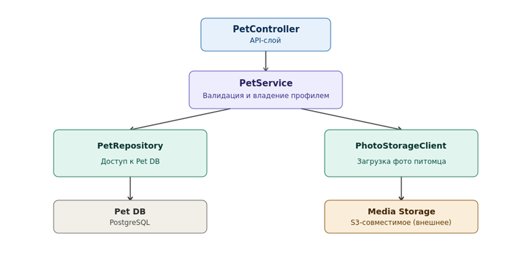

## 1\. 📖 Описание функциональных границ микросервиса

### 1\.1 Диаграмма компонентов архитектуры

{width=900px height=440px}

### 1\.2 Описание микросервиса

Pet Service  - модуль профилей питомцев платформы PetCare. Отвечает за создание, редактирование, просмотр и удаление профилей животных: имя, вид, порода, дата рождения и фото питомца.

Функциональные границы: сервис хранит только данные самого профиля питомца и не отвечает за записи на приём, не хранит медицинскую историю визитов. Загрузка и хранение фотографий вынесены во внешнее объектное хранилище через PhotoStorageClient, сам сервис не хранит бинарные файлы.

## 2\. 🧩 Концептуальное проектирование API метода



---

*  

   Потребители

*  

   Цель

*  

   Задачи

*  

   Входные данные

*  

   Выходные данные

---

*  

   Owner Web App

*  

   Добавить профиль питомца

*  

   Проверить владельца

*  

   ownerId

*  

   Подтверждение, что владелец существует, выдает ошибку, если владелец не найден

---

*  

   Owner Web App

*  

   Добавить профиль питомца

*  

   Создать профиль

*  

   ownerId (имя владельца), name (кличка), species (вид), breed (порода), birthDate (дата рождения)

*  

   ownerId, name, species, breed, birthDate

---

*  

   Owner Web App

*  

   Добавить фото питомца в профиль

*  

   Сохранить фото питомца

*  

   petId, photo (файл)

*  

   photoUrl

---

*  

   Owner Web App

*  

   Получить всех питомцев владельца

*  

   Найти профили по ownerId

*  

   ownerId (query)

*  

   Список профилей питомцев владельца



## 3\. 🤝 Swagger

[openapi:./_index-2.yaml:true]

### 