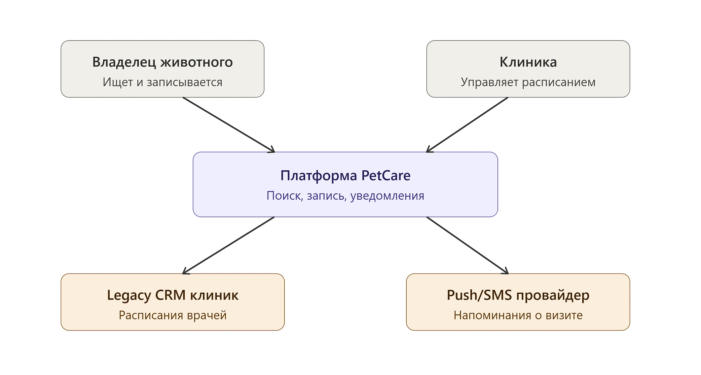
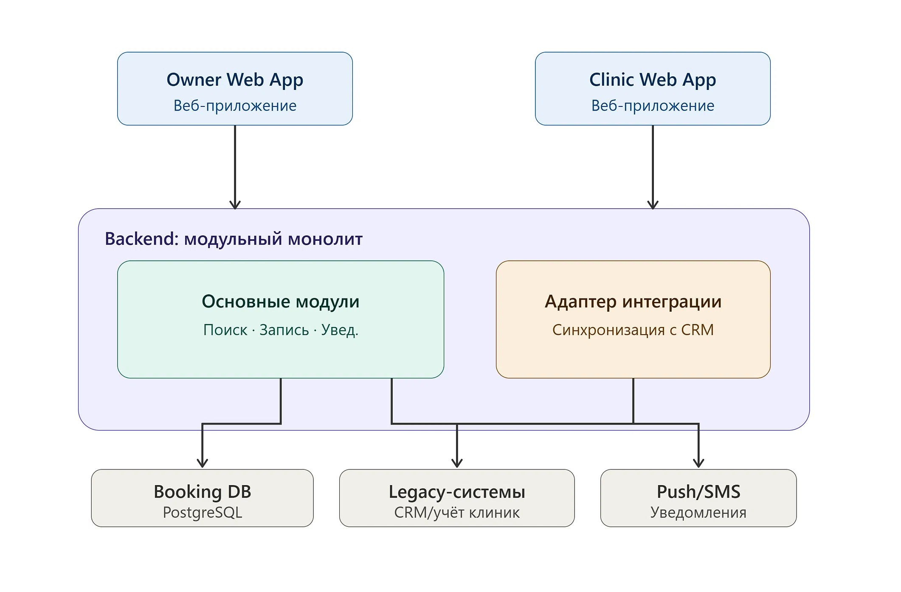
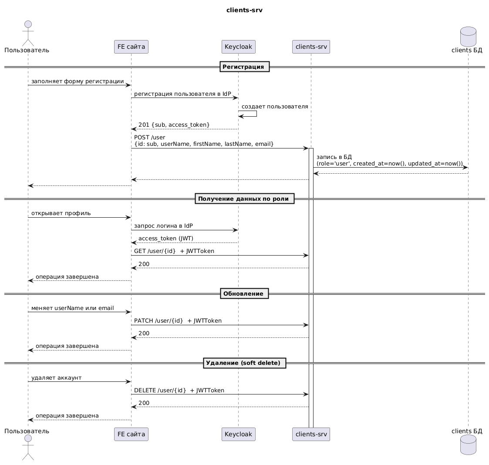
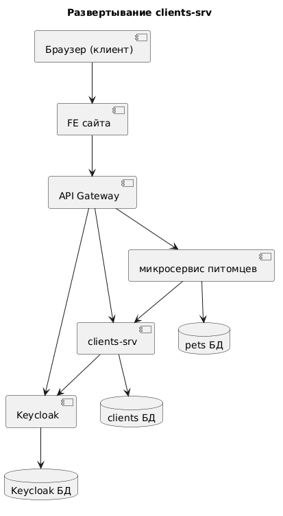
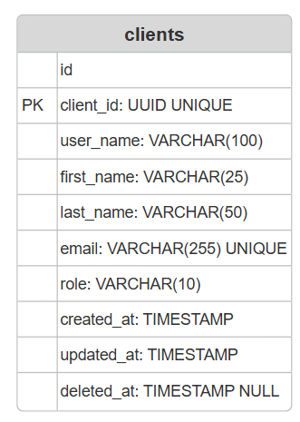

## 1\. 📖 Описание функциональных границ микросервиса

### 1\.1 Диаграмма компонентов архитектуры

{width=2122px height=1138px}

{width=2122px height=1396px}

### 1\.2 Описание микросервиса clients-srv

*Назначение:* управление учётными записями клиентов (владельцев питомцев) -- регистрация, изменение и удаление данных, синхронизация с микросервисом питомцев.

Пароль будет хранить внешний провайдер (например, keycloak). FE получает токен от ldP, и с ним ходит в clients-srv, поэтому эндпоинт с входом/выходом я убрала. Функциональность:

-  **Регистрация** клиента: создание новой УЗ, инициализация базовых атрибутов (роль, дата обновления/создания).

-  **Обновление/удаление** личных данных пользователя.

-  **Синхронизация с карточкой питомца:** обеспечение актуальности данных о питомцах, привязанных к пользователю.

## 2\. 🧩 Концептуальное проектирование API метода

Уточнение: В pets id питомцев остались int64, потому что в микросервисе питомцев будут использоваться внутренние идентификаторы. Помимо того, не запрашиваем каждый раз в качестве хедера AUthorization (jwtToken), так как считаем его security-требованием.



---

*  

   Потребители

*  

   Цель

*  

   Задачи

*  

   Входные данные

*  

   Выходные данные

---

*  

   FE PetCare

*  

   регистрация пользователя при первичном входе на сайт

*  

   создать учетную запись для нового пользователя (обяз. параметры: id = sub из IdP, имя УЗ, имя, фамилия, почта)

*  

   ```
   {
     "id": "f47ac10b-58cc-4372-a567-0e02b2c3d479",
     "userName": "petrivanov",
     "firstName": "Петр",
     "lastName": "Иванов",
     "email": "useremail@example.com"
   }
   ```

*  

   201:

   ```
   {
     "id": "f47ac10b-58cc-4372-a567-0e02b2c3d479",
     "userName": "petrivanov",
     "firstName": "Петр",
     "lastName": "Иванов",
     "email": "useremail@example.com",
     "pets": [
       123,
       234,
       345
     ],
     "role": "user",
     "createdAt": "2026-10-09T10:30:00Z",
     "updatedAt": "2026-10-09T10:30:00Z",
     "deletedAt": null
   }
   ```

---

*  

   FE PetCare

*  

   обновление учетных данных в УЗ в случае, если пользователю хочется сменить имя пользователя или у него сменилась почта

*  

   изменить один из параметров (как минимум 1 из): имя пользователя, почта

*  

   id (== sub из IdP)

   ```
   {
     "userName": "petrivanov",
     "email": "useremail@example.com"
   }
   ```

*  

   200:

   ```
   {
     "id": "f47ac10b-58cc-4372-a567-0e02b2c3d479",
     "userName": "petrivanov",
     "firstName": "Петр",
     "lastName": "Иванов",
     "email": "useremail@example.com",
     "pets": [
       123,
       234,
       345
     ],
     "role": "user",
     "createdAt": "2026-10-09T10:30:00Z",
     "updatedAt": "2026-10-09T10:30:00Z",
     "deletedAt": null
   }
   ```

---

*  

   FE PetCare

*  

   удалить аккаунт в случае, если услуги сайта становятся не актуальны для пользователя/другая причина

*  

   сделать запрос в БД по id для удаления соответствующей записи об УЗ пользователя (SELECT и потом UPDATE deletedAt == True)

*  

   id (== sub из IdP)

*  

   200:

   ```
   {
     "id": "f47ac10b-58cc-4372-a567-0e02b2c3d479",
     "userName": "petrivanov",
     "firstName": "Петр",
     "lastName": "Иванов",
     "email": "useremail@example.com",
     "pets": [
       123,
       234,
       345
     ],
     "role": "user",
     "createdAt": "2026-10-09T10:30:00Z",
     "updatedAt": "2026-10-09T10:30:00Z",
     "deletedAt": "2026-10-09T10:30:00Z"
   }
   ```

---

*  

   FE PetCare, clients-srv и микросервис питомцев

*  

   получение пользователя

*  

   проверить полномочия пользователя в системе: проверяется параметр role. Допускаю (но не в рамках этого микросервиса), что после проверки если role == '‘admin’, то пользователь может удалять другие аккаунты или записи к ветеринару/назначать другим пользователей админами/иметь другой дополнительный функционал. пользователь с role == ‘user’ имеет базовый функционал с созданием карточки питомца, записью его к ветеринару

*  

   id (== sub из IdP)

*  

   200:

   ```
   {
     "id": "f47ac10b-58cc-4372-a567-0e02b2c3d479",
     "userName": "petrivanov",
     "firstName": "Петр",
     "lastName": "Иванов",
     "email": "useremail@example.com",
     "pets": [
       123,
       234,
       345
     ],
     "role": "user",
     "createdAt": "2026-10-09T10:30:00Z",
     "updatedAt": "2026-10-09T10:30:00Z",
     "deletedAt": null
   }
   ```



Таким образом, как я вижу процесс:



---

*  

   Шаг

*  

   Описание

*  

   Метод API

---

*  

   Регистрация

*  

   Пользователь регистрируется на сайте

*  

   POST /user

---

*  

   Получение пользователя

*  

   Получение данных пользователя, включая role

*  

   GET /user/\{id}

---

*  

   Обновление пользователя

*  

   Обновление пользователя

*  

   PATCH /user/\{id}

---

*  

   Удаление пользователя

*  

   Удаление пользователя

*  

   DELETE /user/\{id}



{width=1063px height=1467px}

## 3\. 🤝 Swagger

[swagger.json](./swagger.json) на всякий случай, так как ниже почему-то нет тела ответов в ответах.

[openapi:./_index-2-2.yaml:true]

То есть имеем:

{width=413px height=751px}

Связь с id питомцев будет по uuid == owner_id. БД clients:

{width=331px height=465px}