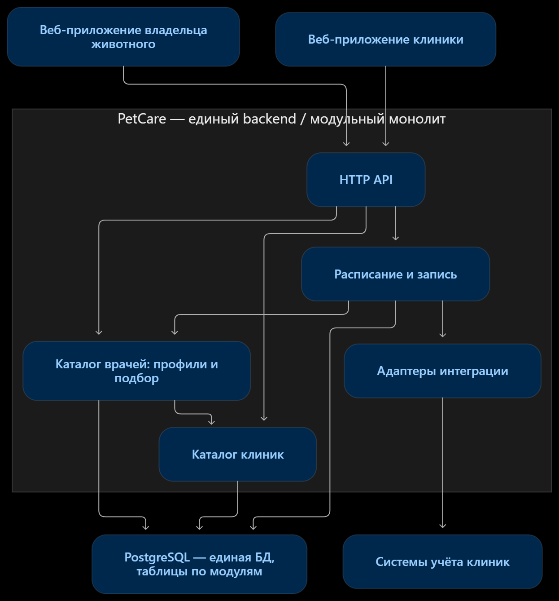

## 1\. 📖 Описание функциональных границ микросервиса

В рамках выбранной архитектуры «микросервис» означает **логически самостоятельный модуль внутри единого backend-приложения PetCare**. Каталог врачей имеет собственную предметную область и контракт API, но на этапе пилота развёртывается вместе с остальными модулями монолита.

### 1\.1 Диаграмма компонентов архитектуры

{width=1246px height=1338px}

**Поток подбора:** веб-приложение передаёт район и специализацию -> каталог находит действующие профили врачей, привязанные к клиникам подходящего района -> пользователь открывает профиль -> для просмотра свободного времени обращается к модулю расписания и записи. Взаимодействие модулей внутри backend локальное; выделение каталога в отдельный процесс на этапе пилота не требуется.

### 1\.2 Описание микросервиса

{width=1672px height=941px}

**Назначение.** Модуль позволяет владельцу животного найти ветеринара по району расположения клиники и специализации, посмотреть профиль врача; уполномоченному сотруднику клиники -- добавить, изменить и скрыть профиль своего врача.

**Данные, за которые отвечает модуль:** идентификатор профиля врача, идентификатор клиники, отображаемое имя, специализации, описание квалификации, стаж и признак активности. Врач в конкретной клинике представлен отдельным профилем: это позволяет не смешивать сведения и права редактирования разных клиник. Адрес и район принадлежат каталогу клиник; каталог врачей использует их при поиске и выдаче, не становится их источником истины.

**Операции в границе модуля:** поиск действующих врачей с фильтрами и пагинацией; чтение карточки врача; создание и полная замена данных профиля сотрудником соответствующей клиники; деактивация профиля. Поиск возвращает сведения о враче и клинике, но не гарантирует наличие свободного времени.

**За пределами модуля:** создание клиник и районов, ведение слотов/отпусков, проверка и создание записи, перенос и отмена записи, напоминания, а также обмен расписанием с разными legacy-системами клиник. Этими процессами занимаются соседние модули и адаптеры. При деактивации профиля история уже состоявшихся приёмов сохраняется; если есть будущие записи, операция отклоняется до их обработки модулем записи.

**Допущения для контракта:** идентификаторы клиник, районов и специализаций уже предоставляются соответствующими справочниками; формат идентификаторов -- положительное целое число. Сотрудник клиники авторизуется токеном и может изменять только профили своей клиники. Публичный поиск показывает только действующие профили. Эти детали проектирования добавлены для однозначного API: в исходном описании проекта они не конкретизированы.

## 2\. 🧩 Концептуальное проектирование API метода



---

*  

   Потребители

*  

   Цель

*  

   Задачи

*  

   Входные данные

*  

   Выходные данные

---

*  

   FE веб-приложения владельца животного

*  

   Подобрать ветеринара

*  

   Найти действующие профили  (`GET /doctors`)

*  

   `districtId`, `specializationId`; необязательные `clinicId`, `limit`, `offset`

*  

   Список карточек врачей с `doctorId`, именем, специализациями, стажем, клиникой и её районом; `total`, `limit`, `offset`

---

*  

   FE веб-приложения владельца животного

*  

   Изучить выбранного врача

*  

   Открыть профиль (`GET /doctors/{doctorId}`)

*  

   `doctorId` -- path

*  

   Профиль врача с описанием квалификации, специализациями и сведениями о клинике; при отсутствии действующего профиля -- `404`

---

*  

   FE веб-приложения клиники

*  

   Сделать нового врача доступным для поиска

*  

   Создать профиль врача в своей клинике (`POST /doctors`)

*  

   JSON body: `clinicId`, `displayName`, `specializationIds`, `experienceYears`, `description`; токен сотрудника -- header

*  

   `201`, созданный профиль врача; заголовок `Location`; ошибки валидации/доступа

---

*  

   FE веб-приложения клиники

*  

   Поддерживать достоверность карточки

*  

   Полностью обновить изменяемые данные профиля (`PUT /doctors/{doctorId}`)

*  

   `doctorId` -- path; JSON body: `displayName`, `specializationIds`, `experienceYears`, `description`; токен -- header

*  

   `200`, обновлённый профиль; `403`, если врач относится к другой клинике; `404`, если профиль не найден

---

*  

   FE веб-приложения клиники

*  

   Убрать врача из поиска

*  

   Деактивировать профиль (`DELETE /doctors/{doctorId}`)

*  

   `doctorId` -- path; токен -- header

*  

   `204` без тела; `409`, если на врача есть будущие записи, которые требуется обработать



## 3\. 🤝 Swagger

[openapi:./_index-2.yaml:true]

###