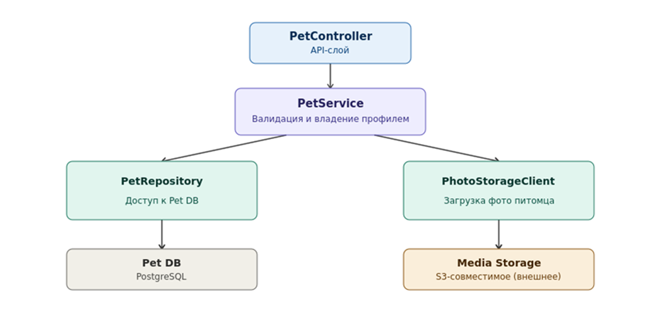

1\. 📖 Описание функциональных границ микросервиса

1\.1 Диаграмма компонентов архитектуры

{width=930px height=454px}

1\.2 Описание микросервиса

Pet Service - модуль профилей питомцев платформы PetCare. Отвечает за создание, редактирование, просмотр и удаление профилей животных: имя, вид, порода, дата рождения и фото питомца.

Функциональные границы: сервис хранит только данные самого профиля питомца и не отвечает за записи на приём, не хранит медицинскую историю визитов. Загрузка и хранение фотографий вынесены во внешнее объектное хранилище через PhotoStorageClient, сам сервис не хранит бинарные файлы.

2\. 🧩 Концептуальное проектирование API метода

| **Потребители** | **Цель**                         | **Задачи**               | **Входные данные**                                                                               | **Выходные данные**                                                            |
|-----------------|----------------------------------|--------------------------|--------------------------------------------------------------------------------------------------|--------------------------------------------------------------------------------|
| Owner Web App   | Добавить профиль питомца         | Проверить владельца      | ownerId                                                                                          | Подтверждение, что владелец существует, выдает ошибку, если владелец не найден |
| Owner Web App   | Добавить профиль питомца         | Создать профиль          | ownerId (имя владельца), name (кличка), species (вид), breed (порода), birthDate (дата рождения) | petId, name, species, breed, birthDate                                         |
| Owner Web App   | Добавить фото питомца в профиль  | Сохранить фото питомца   | petId, photo (файл)                                                                              | photoUrl                                                                       |
| Owner Web App   | Получить всех питомцев владельца | Найти профили по ownerId | ownerId (query)                                                                                  | Список профилей питомцев владельца                                             |

3\. 🤝 Swagger