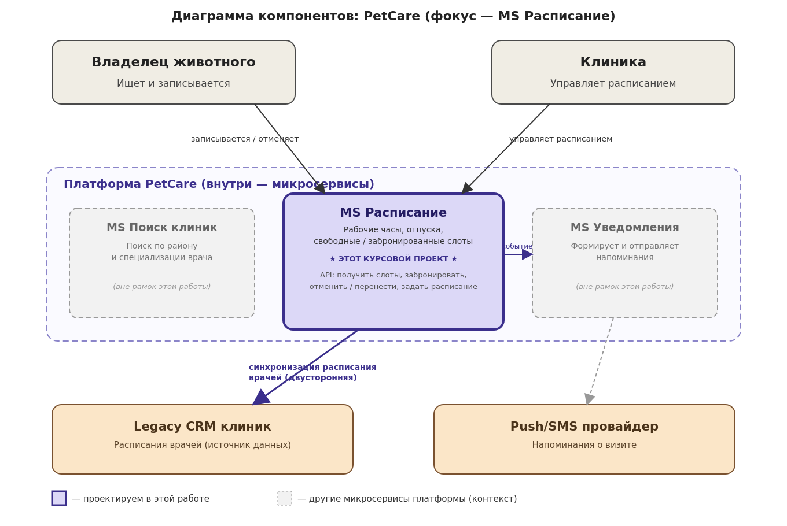

###### 

## 1\. 📖 Описание функциональных границ микросервиса

### 1\.1 Диаграмма компонентов архитектуры

{width=1360px height=910px}

### 1\.2 Описание микросервиса

**MS Расписание** обеспечивает следующую функциональность:

**Для клиники (управление расписанием врачей):**

-  Задание рабочих часов врача (дни недели, время приёма)

-  Указание периодов недоступности врача (отпуск, больничный, выходной)

-  Синхронизация базового расписания с внутренней (legacy) системой учёта клиники

**Для владельца животного (запись на приём):**

-  Получение списка свободных слотов врача с учётом рабочих часов, отпусков и уже существующих записей

-  Создание записи (бронирование слота) на приём к врачу

-  Отмена существующей записи

-  Перенос записи на другой слот

**Общее (для обеих сторон):**

-  Публикация события об изменении статуса записи (создана / отменена / перенесена) -- для дальнейшей обработки другими сервисами (например, чтобы MS Уведомлений отправил напоминание)

**Микросервис НЕ отвечает за:**

-  Поиск клиник по району и специализации врача

-  Формирование и отправку push/SMS-уведомлений владельцу

-  Хранение профилей владельцев животных и врачей (зона ответственности сервиса пользователей/профилей)

## 2\. 🧩 Концептуальное проектирование API метода



---

*  

   Потребители

*  

   Цель

*  

   Задачи

*  

   Входные данные

*  

   Выходные данные

---

*  

   Frontend владельца

*  

   Показать владельцу доступное для записи время

*  

   1\. Определить рабочие часы врача на дату2. Исключить время отпуска/недоступности3. Исключить уже забронированные слоты4. Вернуть оставшиеся свободные интервалы

*  

   ID врача, дата (или диапазон дат)

*  

   Список свободных слотов (дата, время начала, время окончания)

---

*  

   Frontend владельца

*  

   Записать владельца на приём к врачу

*  

   1\. Проверить, что слот всё ещё свободен2. Создать запись на приём3. Пометить слот как занятый4. Инициировать событие "запись создана"

*  

   ID врача, ID владельца, ID животного, дата и время слота

*  

   ID созданной записи, статус, подтверждённые дата/время

---

*  

   Frontend владельца

*  

   Отменить ранее созданную запись

*  

   1\. Проверить, что запись существует и принадлежит владельцу2. Изменить статус записи на "отменена"3. Освободить слот4. Инициировать событие "запись отменена"

*  

   ID записи

*  

   Статус операции (успех/ошибка), обновлённый статус записи

---

*  

   Frontend владельца

*  

   Перенести запись на другое время

*  

   1\. Проверить доступность нового слота2. Освободить старый слот3. Занять новый слот4. Инициировать событие "запись перенесена"

*  

   ID записи, новая дата и время слота

*  

   Обновлённые дата/время записи, статус операции

---

*  

   Frontend клиники

*  

   Настроить рабочие часы врача в клинике

*  

   1\. Проверить корректность вводимых интервалов (нет пересечений)2. Сохранить рабочие часы по дням недели

*  

   ID врача, ID клиники, список рабочих интервалов по дням недели

*  

   Статус операции, сохранённое расписание

---

*  

   Frontend клиники

*  

   Отметить врача как недоступного на период времени

*  

   1\. Проверить корректность периода2. Проверить конфликты с уже забронированными записями (предупредить клинику)3. Сохранить период недоступности

*  

   ID врача, дата начала, дата окончания, причина (опционально)

*  

   Статус операции, список конфликтующих записей (если есть)



## 3\. 🤝 Swagger

[openapi:./_index.yaml:true]

### 