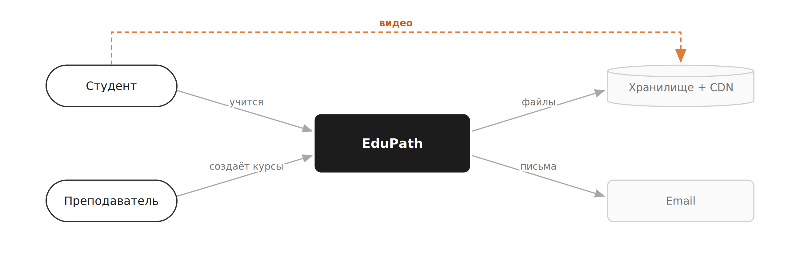
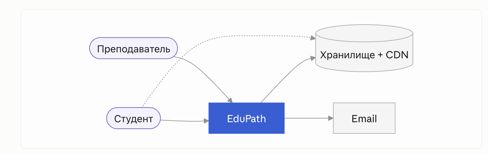

Участники группы

-  Алиса Солодовник

-  Алиса Ким

-  Маргарита Кабанова

-  Иван Перфилов

-  Егор Стасюк

-  Семен Петрухин

## 📖 1.  Анализ по framework (6 вопросов архитектора)



---

*  

   Вопрос

*  

   Ответ команды

---

*  

   ⏱️Скорость изменений бизнес-требований

*  

   Высокая. Так как форматы уроков, логика тестов, правила выдачи сертификата могут  меняться каждые несколько недель. Границы модулей ещё не устоялись, следовательно нужна архитектура, где изменение контракта между модулями -- это рефакторинг в одной кодовой базе, а не согласование версий API между сервисами.

---

*  

   👥 Количество независимых команд

*  

   Одна, небольшая. Нужен как минимум один сильный бэкендер -- вся сложность ляжет на него

---

*  

   🏛️ Legacy-ограничения

*  

   Технического legacy нет, но есть регуляторное. Платформа собирает персональные данные учеников -- значит согласия, политика конфиденциальности, хранение ПД по 152-ФЗ. Плюс требование равного доступа к материалам для всех учеников независимо от успеваемости: это ограничение на логику выдачи контента, его нельзя ломать ради продуктовых экспериментов

---

*  

   🛡️ Требования к SLA / отказоустойчивости

*  

   Система должна выдержать всплеск и обработать каждое нажатие ровно один раз -- двойной клик не должен превращаться в два запроса и две попытки сдачи. Отсюда: идемпотентность на отправке ответов, блокировка кнопки на фронте, уникальные ключи на попытках

---

*  

   💰 Бюджет и сроки

*  

   Объём финансирования на запуск -- порядка 1 млн ₽. Указанных средств достаточно для реализации MVP силами небольшой команды в горизонте нескольких месяцев. Развёртывание и последующее сопровождение распределённой инфраструктуры в рамках данного бюджета нецелесообразно.

---

*  

   ⚙️Зрелость DevOps-культуры команды

*  

   Средняя. Базовые вещи команда потянет, но узкое место -- не инструменты, а люди: нужен грамотный бэкендер, который удержит запутанную предметную логику в порядке



## 🧩 2. Выбранный архитектурный стиль

**Стиль: Модульный монолит**

**Обоснование выбора** (3-4 предложения):

-  Простота и дешевизна

-  Масштабируемость

-  Готовность к будущему выделению сервисов

-  Соответствие размеру и опыту команды

## 📐 3. С4-диаграмма

### **Level 1 -- Context**

:::tip:true Подробнее

:::

{width=2600px height=825px}

:::tip:true 

Кто взаимодействует с системой: пользователи, внешние системы

:::

### Level 2 -- Containers

:::tip 

Из каких крупных частей состоит система.

:::

:::note 

Необязательно, но кто сделал - молодец

:::

{width=2600px height=1125px}

## 🚩 4. Главный риск выбранного решения

-  Прохождение курса подтверждает клиент, значит сертификат можно подделать.

-   

## 🔀 5. Отвергнутая альтернатива

**Какой стиль рассматривали, но не выбрали:** отдельные сервисы

**Почему отказались:**

-  Цена не окупается на старте

-  Нечего масштабировать независимо

-   

## 👩‍💻 6. Ключевые бизнес-операции системы

:::tip 

5–7 главных действий пользователей/сервисов -- пригодится на следующем занятии по проектированию API. Например: "разместить заказ", "проверить статус", "отменить"...

:::

1. Просмотреть каталог курсов и записаться на курс

2. Пройти урок и зафиксировать прогресс по курсу

3. Начать попытку итогового теста и отправить ответы

4. Получить результат теста (оценка/проценты)

5. Получить сертификат при успешной сдаче

6. Создать курс, наполнить его уроками и загрузить материалы -- Преподаватель

7. Создать итоговый тест: вопросы и проходной балл -- Преподаватель