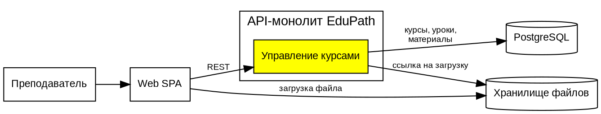

1\. 📖 Описание функциональных границ микросервиса

### 1\.1 Диаграмма компонентов архитектуры

{width=1337px height=256px}

### 1\.2 Описание микросервиса

Архитектура EduPath -- модульный монолит, поэтому вместо отдельного микросервиса выбрана функциональная зона -- модуль «Управление курсами». Он закрывает бизнес-операции 6 и 7 из архитектурной каты: преподаватель создаёт курс, наполняет его уроками и материалами и создаёт итоговый тест.

Назначение модуля: провести курс от пустого черновика до готового к публикации курса с уроками, материалами и итоговым тестом.

**Взаимодействие.**

-  Web SPA -> модуль: REST API /api/v1, авторизация по токену. Методы доступны только преподавателю, изменять курс может только его автор.

-  Модуль -> хранилище: модуль выдаёт временную ссылку, файл загружается из браузера напрямую в хранилище, не нагружая монолит.

## 2\. 🧩 Концептуальное проектирование API метода



---

*  

   Потребители

*  

   Цель

*  

   Задачи

*  

   Входные данные

*  

   Выходные данные

---

*  

   Web SPA (кабинет препода­вателя)

*  

   Создать курс

*  

   Проверить роль преподавателя и обязательные поля, создать курс в статусе «черновик»

*  

   Название, описание, категория

*  

   Идентификатор курса, статус

---

*  

   Web SPA (кабинет препода­вателя)

*  

   Загрузить материал урока

*  

   Проверить тип и размер файла, зарегистрировать материал, выдать временную ссылку на загрузку в хранилище

*  

   Идентификатор курса, имя файла, тип файла, размер

*  

   Идентификатор материала, ссылка на загрузку

---

*  

   Web SPA (кабинет препода­вателя)

*  

   Добавить урок в курс

*  

   Проверить, что преподаватель -- автор курса, определить порядковый номер, сохранить урок и привязать материалы

*  

   Идентификатор курса, название урока, порядковый номер, текст урока, идентификаторы материалов

*  

   Идентификатор урока, порядковый номер



## 3\. 🤝 Swagger

[openapi:./_index.yaml:true]

### 