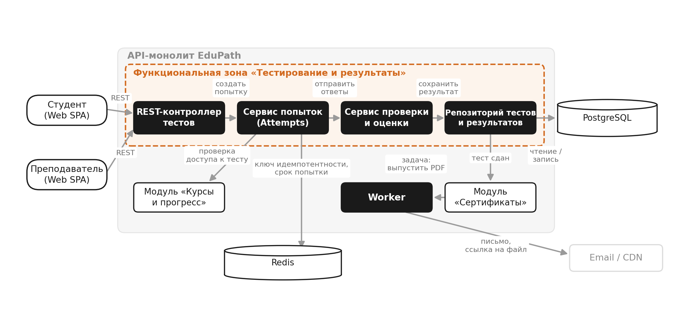

## 1\. 📖 Описание функциональных границ микросервиса

### 1\.1 Диаграмма компонентов архитектуры

{width=2087px height=948px}

### 1\.2 Описание микросервиса

Архитектурный стиль EduPath -- модульный монолит, отдельных микросервисов в решении нет. Поэтому для проектирования API выбрана функциональная зона внутри API-монолита -- «Тестирование и результаты» (Assessment). Она покрывает бизнес-операции 3–5 из архитектурного ката: начать попытку итогового теста, отправить ответы, получить результат, а также создание теста преподавателем.

Зона отвечает за итоговый контроль знаний на курсе: хранит тесты и вопросы, запускает и ограничивает попытки студентов, проверяет ответы, считает балл и является единственным источником правды о том, сдан ли итоговый тест курса.

**Состав зоны**

• REST-контроллер тестов -- приём HTTP-запросов, валидация, авторизация;

• Сервис попыток (Attempts) -- создание попытки, лимит попыток, срок сдачи, идемпотентность;

• Сервис проверки и оценки -- сравнение ответов с эталоном, расчёт балла и признака passed;

• Репозиторий тестов и результатов -- хранение тестов, вопросов, попыток и оценок.

• Хранилища: PostgreSQL (тесты, вопросы, попытки, результаты), Redis (ключи идемпотентности и срок жизни попытки).

**Что входит в функциональные границы**

• создание итогового теста преподавателем: вопросы, варианты, проходной балл, лимит попыток, ограничение времени;

• запуск попытки студентом с проверкой права доступа и лимита попыток;

• выдача вопросов студенту без правильных ответов;

• приём ответов, их проверка, расчёт балла и признака прохождения;

• хранение результатов и выдача их другим модулям монолита.

**Что за границами зоны (соседние модули)**

• каталог курсов, уроки и прогресс -- модуль «Курсы и прогресс»; зона только спрашивает у него, допущен ли студент к итоговому тесту;

• выпуск сертификата, генерация PDF и письмо -- модуль «Сертификаты» и Worker; они читают результат у зоны, но не считают его;

• аутентификация и роли -- общий модуль доступа; зона получает токен и проверяет права по нему.

**Потребители API зоны**

• Web SPA от имени студента -- прохождение теста и просмотр результата;

• Web SPA от имени преподавателя -- создание итогового теста;

• модуль «Сертификаты» -- внутренний потребитель: проверяет, сдан ли тест, перед выпуском сертификата.

## 2\. 🧩 Концептуальное проектирование API метода



---

*  

   Потребители

*  

   Цель

*  

   Задачи

*  

   Входные данные

*  

   Выходные данные

---

*  

   Web SPA, страница курса

   (от имени студента)

*  

   Начать попытку итогового теста

*  

   Проверить, что курс пройден и лимит попыток не исчерпан; создать попытку; выдать вопросы без правильных ответов; не создать вторую попытку при двойном клике

*  

   Идентификатор теста (testId), ключ идемпотентности (Idempotency-Key), токен студента

*  

   Идентификатор попытки (attemptId), номер попытки (attemptNumber), срок сдачи (expiresAt), список вопросов с вариантами

---

*  

   Web SPA, страница прохождения теста (студент)

*  

   Отправить ответы и получить оценку

*  

   Проверить статус и срок попытки; сохранить ответы; сравнить с правильными; рассчитать балл и признак сдачи; закрыть попытку

*  

   Идентификатор попытки (attemptId), список ответов (questionId, selectedOptionIds)

*  

   Балл (score), максимум (maxScore), процент (percent), признак сдачи (passed), время отправки (submittedAt)

---

*  

   Web SPA, страница результатов (студент)

*  

   Посмотреть результат попытки

*  

   Найти попытку по идентификатору; проверить, что она принадлежит этому студенту; вернуть статус и оценку

*  

   Идентификатор попытки (attemptId)

*  

   Статус попытки (status), номер попытки, балл, процент, признак сдачи, время отправки

---

*  

   Модуль «Сертификаты»

   (внутренний потребитель)

*  

   Узнать, сдан ли итоговый тест курса

*  

   Найти попытки студента по курсу; отфильтровать сданные; вернуть лучший результат и признак прохождения

*  

   Идентификатор курса (courseId), идентификатор студента (studentId), фильтр status, limit

*  

   Признак сдачи (passed), лучший процент (bestPercent), список результатов попыток

---

*  

   Web SPA, кабинет преподавателя

*  

   Создать итоговый тест курса

*  

   Принять вопросы и варианты ответов; проверить проходной балл и лимиты; сохранить тест и привязать его к курсу

*  

   Идентификатор курса (courseId), название, проходной балл, лимит попыток, время на тест, вопросы с вариантами и правильными ответами

*  

   Идентификатор теста (testId), courseId, число вопросов, проходной балл



## 3\. 🤝 Swagger

[openapi:./_index.yaml:true]

### 