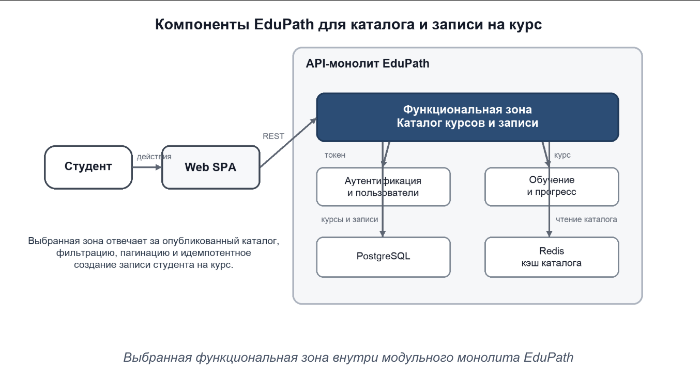

## 1\. 📖 Описание функциональных границ микросервиса

### 1\.1 Диаграмма компонентов архитектуры


{width=1354px height=720px}


### 1\.2 Описание микросервиса

```
Выбранная функциональная зона. Каталог курсов и записи является модулем API-монолита EduPath. Она обслуживает Web SPA и работает от имени авторизованного студента.

Внутри границы. Выдача только опубликованных курсов, поиск и фильтрация, пагинация, проверка доступности курса, создание записи студента, защита от дублей и идемпотентная обработка повторного запроса.

Данные и хранение. Основные данные курсов и записей хранятся в PostgreSQL. Redis может кэшировать чтение каталога, но не является источником истины для записи на курс.

За границей. Аутентификация и роли, создание учебного контента преподавателем, прохождение уроков, прогресс, тестирование, сертификаты, Email и CDN. Модуль получает идентификатор студента из проверенного токена и не принимает его из тела запроса.
```

## 2\. 🧩 Концептуальное проектирование API метода



---

*  

   Потребители

*  

   Цель

*  

   Задачи

*  

   Входные данные

*  

   Выходные данные

---

*  

   Web SPA от имени студента

*  

   Показать доступный каталог курсов

*  

   Запросить опубликованные курсы; применить поиск, фильтры и пагинацию; отобразить карточки курсов.

*  

   q; category; level; page; pageSize

*  

   Список курсов: courseId, title, shortDescription, category, level, instructorName, durationMinutes, enrollmentAvailable; данные пагинации.

---

*  

   Web SPA от имени авторизованного студента

*  

   Записать студента на выбранный курс

*  

   Проверить курс и доступность; исключить повторную запись; создать запись идемпотентно; вернуть созданный ресурс.

*  

   courseId; Bearer-токен; Idempotency-Key. studentId определяется по токену.

*  

   enrollmentId, courseId, status, enrolledAt; ссылки self и course; заголовок Location.



## 3\. 🤝 Swagger

[openapi:./_index-2.yaml:true]

### 