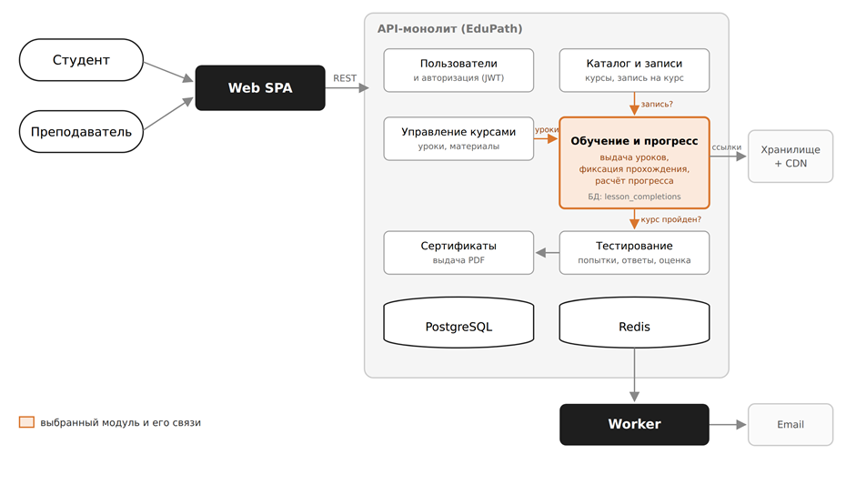

## 1\. 📖 Описание функциональных границ микросервиса

### 1\.1 Диаграмма компонентов архитектуры

{width=930px height=544px}

### 1\.2 Описание микросервиса

```
Так как архитектура EduPath — модульный монолит, а не микросервисы, в качестве «сервиса» выбрана функциональная зона — модуль «Обучение и прогресс». Он реализует ключевую бизнес-операцию: Пройти урок и зафиксировать прогресс по курсу. Данный модуль отвечает за список уроков курса со статусами прохождения, содержимое урока, промежуточный прогресс (сохранение позиции просмотра видео, чтобы студент мог продолжить урок с того же места), проверку условий прохождения на сервере и запись факта прохождения урока.  
```

## 2\. 🧩 Концептуальное проектирование API метода



---

*  

   Потребители

*  

   Цель

*  

   Задачи

*  

   Входные данные

*  

   Выходные данные

---

*  

   Студент

*  

   Список уроков курса.

   Увидеть уроки курса и какие уже пройдены

*  

   1. Проверить, что студент записан на курс

   2. Для каждого урока вычислить статус: пройден / доступен / закрыт

*  

   ID курса

*  

   Список уроков: название, номер, пройден или нет,

   % прохождения курса

---

*  

   Студент

*  

   Открыть урок. Посмотреть урок

*  

   1. Проверить доступ к уроку

   2. Отдать текст урока, ссылки на видео и файлы

*  

   ID курса

   ID урока

*  

   название и текст урока, ссылка на видео и 

   файлы урока

---

*  

   Студент

*  

   Отметить урок пройденным.

   Засчитать урок и обновить прогресс по курсу

*  

   1. Проверить, что видео досмотрено

   2. Сохранить отметку и пересчитать прогресс

*  

   ID курса

   ID урока

   Время в уроке

    % просмотра видео

*  

   отметка о прохождении (ID, дата), новый % прохождения курса и 

   открыт ли итоговый тест

---

*  

   Студент

   Преподаватель

*  

   Узнать прогресс по курсу.

   Понять, сколько пройдено и можно ли сдавать тест

*  

   1. Посчитать пройденные уроки

   2. Проверить, открыт ли итоговый тест

*  

   ID курса

   ID студента (только для преподавателя)

*  

   пройдено уроков из общего числа, % прохождения курса,

   открыт ли итоговый тест



## 3\. 🤝 Swagger

[openapi:./_index-3.yaml:true]

###