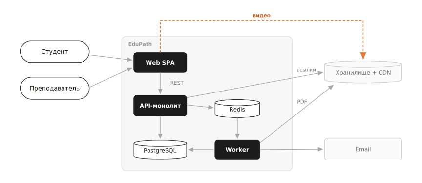

1\. 📖 Описание функциональных границ микросервиса

### 1\.1 Диаграмма компонентов архитектуры

{width=864px height=374px}

### 1\.2 Описание микросервиса

```
В проекте выбрана архитектура «модульный монолит», поэтому я рассматриваю не отдельный микросервис, а модуль итогового тестирования внутри общего API.
Модуль позволяет студенту получить итоговый тест, начать попытку, отправить ответы и узнать результат. Преподаватель может создать и опубликовать тест. Модуль хранит тесты, вопросы, попытки и результаты в PostgreSQL. Он не отвечает за авторизацию, каталог курсов, файлы, отправку писем и создание сертификатов.
```

## 2\. 🧩 Концептуальное проектирование API метода



---

*  

   Потребители

*  

   Цель

*  

   Задачи

*  

   Входные данные

*  

   Выходные данные

---

*  

   Web SPA от имени студента

*  

   Получить итоговый тест

*  

   Проверить доступ к курсу и вернуть опубликованный тест без правильных ответов

*  

   courseId

*  

   testId, название, вопросы, варианты ответов, время и число попыток

---

*  

   Web SPA от имени студента

*  

   Начать попытку

*  

   Проверить число оставшихся попыток и создать новую попытку

*  

   testId

*  

   attemptId, статус попытки, время начала

---

*  

   Web SPA от имени студента

*  

   Отправить ответы

*  

   Сохранить ответы, посчитать результат и завершить попытку

*  

   attemptId, ответы на вопросы

*  

   Баллы, процент, признак успешной сдачи

---

*  

   Web SPA от имени преподавателя

*  

   Создать итоговый тест

*  

   Сохранить название, вопросы, варианты ответов и проходной балл

*  

   courseId, название, вопросы, варианты и правильные ответы

*  

   testId и статус теста



## 3\. 🤝 Swagger

[openapi:./_index-4.yaml:true]

### 