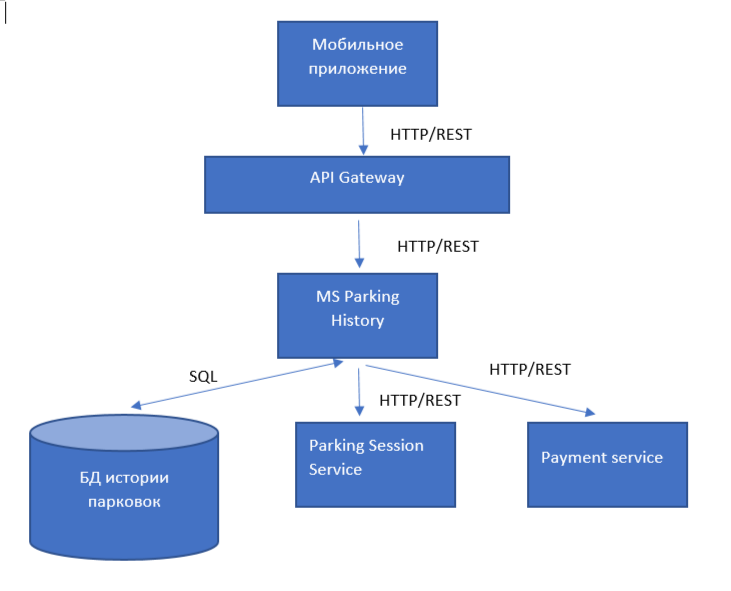

## 1\. 📖 Описание функциональных границ микросервиса

### 1\.1 Диаграмма компонентов архитектуры

{width=731px height=591px}

### 1\.2 Описание микросевриса

**Сервис по просмотру истории парковок** MS ParkingHistory

**Описание:** микросервис предоставляет водителю информацию о его завершенных парковочных сессиях.Функции:

-  получение истории парковок водителя;

-  получение детальной информации по конкретной сессии парковки (парковочное место/зона, Дата и время начала и завершения сессии, Длительность парковки, Итоговая стоимость, Статус оплаты (оплачено / не оплачено / в процессе))

-  фильтрация истории парковок по периоду, по статусу оплаты

## 2\. 🧩 Концептуальное проектирование API метода



---

*  

   Потребители

*  

   Цель

*  

   Задачи

*  

   Входные данные

*  

   Выходные данные

---

*  

   front-end (мобильное приложение водителя)

*  

   Получить историю парковок водителя

*  

   Запросить список завершённых сессий по идентификатору водителя

*  

   ИД водителя, период, статус оплаты

*  

   Список сессий: место/зона, дата и время начала/окончания, стоимость, статус оплаты

---

*  

   front-end (мобильное приложение водителя)

*  

   Получить детальную информацию по конкретной сессии

*  

   Запросить данные по идентификатору сессии

*  

   ИД сессии

*  

   Место/зона, дата и время начала и окончания, длительность, итоговая стоимость, статус оплаты

---

*  

   MS Parking History

*  

   Получить данные о завершённой парковочной сессии

*  

   Получить от Parking Session Service данные по завершённой сессии и сохранить их у себя

*  

   ИД сессии

*  

   Место/зона, дата и время начала и окончания, длительность, стоимость

---

*  

   MS Parking History

*  

   Получить статус оплаты сессии

*  

   Получить от Payment Service статус оплаты по сессии и сохранить/обновить его у себя

*  

   ИД сессии

*  

   Статус оплаты (оплачено / не оплачено / в процессе)



## 3\. 🤝 Swagger

[openapi:./_index-2.yaml:true]

### 