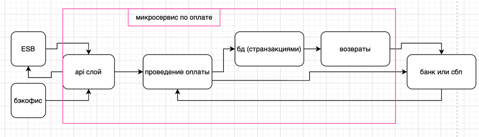

## 1\. 📖 Описание функциональных границ микросервиса

### 1\.1 Диаграмма компонентов архитектуры

{width=974px height=279px}

### 1\.2 Описание микросервиса

Сервис вызывается через ESB и отвечает только за проведение платежа. Он не знает про парковочные места и не общается с legacy-системой.

Обеспечивает следующую функциональность:

-  **Принимает запрос на оплату** от ESB: ID парковочной сессии, сумму, метод оплаты (токен карты или номер телефона для СБП).

-  **Проверяет данные**: все ли поля заполнены, не истёк ли токен, совпадает ли сумма

-  **Выбирает метод оплаты**:

Карта - если передан токен, оплата идёт через банк-эквайер

СБП - если передан номер телефона, формируется ссылка для приложения банка, деньги списываются через сбп

-  **Отправляет запрос в банк или СБП** и ждёт ответ.

-  **Обрабатывает ответ**:

Оплата прошла - получает ID транзакции, код авторизации, ссылку на чек

Оплата не прошла - получает код и текст ошибки (недостаточно средств, отклонено и т.п.)

-  **Возвращает статус в ESB**, чтобы оркестратор запустил следующие шаги (уведомление, синхронизация с legacy)

-  **Сохраняет транзакцию в БД**: ID сессии, сумма, метод, статус, время, ID транзакции. Это нужно для истории и разбора спорных ситуаций

-  **Предоставляет API для бэкофиса**

Проверить статус транзакции по ID сессии

Инициировать возврат средств (полный или частичный) через банк

-  **Не участвует в синхронизации с legacy-системой паркоматов** - это отдельная подзадача, выполняемая после успешной оплаты

## 2\. 🧩 Концептуальное проектирование API метода



---

*  

   Потребители

*  

   Цель

*  

   Задачи

*  

   Входные данные

*  

   Выходные данные

---

*  

   

*  

   

*  

   

*  

   

*  

   

---

*  

   

*  

   

*  

   

*  

   

*  

   



## 3\. 🤝 Swagger

[openapi:./_index-3.yaml:true]

### 